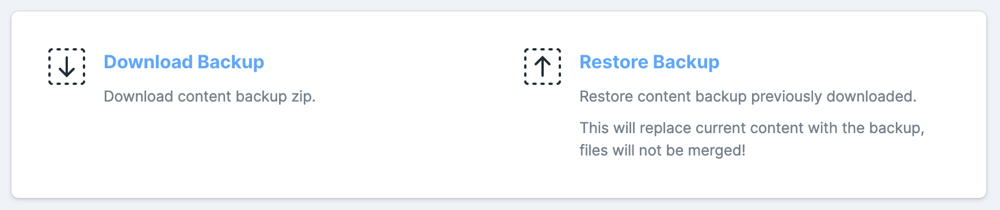

# Statamic Content Backup

 

Statamic Content Backup is a Statamic addon that allows control panel users to create, download, upload and restore content backups easily.



## New features added

- Added support for backing up database-stored content
- Added backup history

## Installation

Install this addon running the following command from your project's root directory:

```bash
composer require lucapon/statamic-content-backup
```

After installation, publish the configuration file with:

```bash
php artisan vendor:publish --tag=statamic-content-backup-config
```

Run the following command to start the Laravel queue to handle backups creation in the background:

```bash
php artisan queue:work
```

## Customization

You can customize which files and database tables are included in the backup by editing the configuration file located at: `config/statamic-content-backup.php`

## Upgrading

If you upgrade to version `^2.0.0` or `^3.0.0`, it is recommended to republish the configuration file to ensure compatibility with the updated features. Run the following command:

```bash
php artisan vendor:publish --tag=statamic-content-backup-config --force
```

This will overwrite your old configuration file with the updated version. Be sure to review the new configuration file for any additional options or changes.
