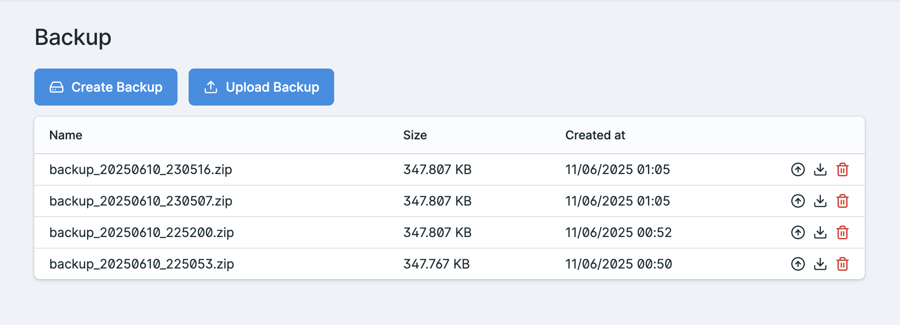

# Statamic Content Backup

Statamic Content Backup is a Statamic addon that enables a control panel user to download and restore content backups.





## How to Install

You can search for this addon in the `Tools > Addons` section of the Statamic control panel and click **install**, or run the following command from your project root:

``` bash
composer require lucapon/statamic-content-backup
```

## How to Customize

You can choose which files to include in the backup by modifying the ```config/statamic-content-backup.php``` file.
